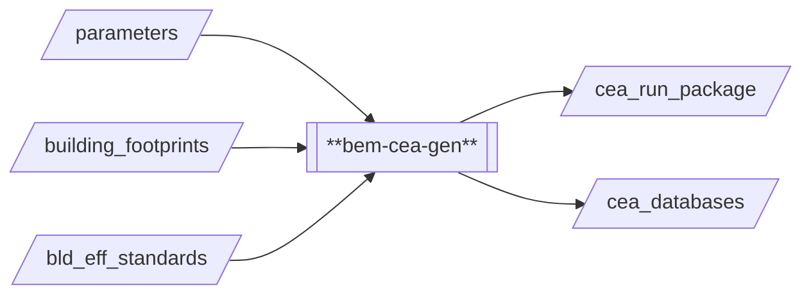
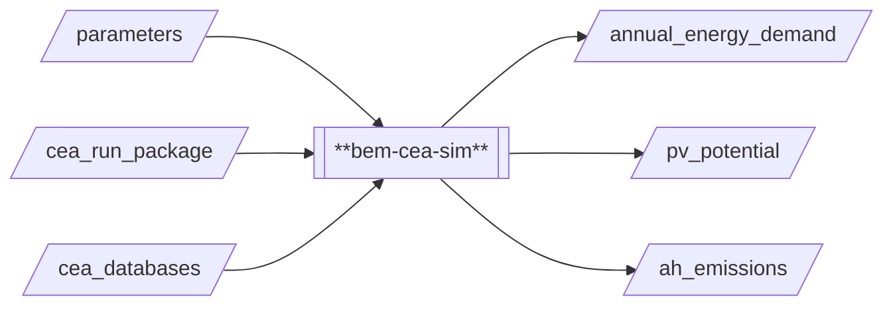
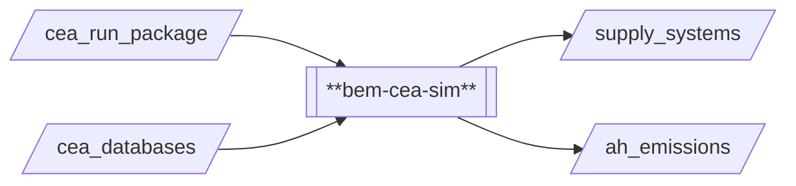

# Building Energy Model / CEA 

## Introduction
The Building Energy Model (BEM) makes use of [CityEneryAnalyst](https://github.com/cooling-singapore/CEA_for_DUCT) (CEA) as the 
underlying model to calculate building energy demand/generation based on several 
factors, e.g. occupancy, cooling demand, solar radiation and photovoltaic panels.
Heat rejection from buildings (e.g., from air conditioning) is estimated based on 
energy demand. For district cooling, an optimization algorithm is used to generate 
district cooling networks based on several opposing factors, e.g., cost, system 
energy demand and anthropogenic heat.

The underlying model for using CEA in Cooling Singapore has been 
developed by Mathias Niffeler, Luis Santos, and Reynold Mok. It has been onboarded
to the Cooling Singapore Simulation-as-a-Service (Sim-aaS) platform by SEC Digital 
Twin Lab. For questions regarding the underlying model/method or the Sim-aaS 
adapters (`bem-cea-gen`, `bem-cea-bee` and `bem-cea-dcn`), please contact 
[cooling.singapore@sec.ethz.ch](cooling.singapore@sec.ethz.ch).

## Prerequisites
- Python 3.8
- City Energy Analyst (CEA)
- CEA Heat Rejection Plugin

## Technical Documentation

### `bem-cea-gen`

This processor generates the required CEA input files and structure, such as CEA databases, CEA building properties,
weather file, etc., with minimal input from the user. It fetches a CEA databases created specifically for analyses 
required by Cooling Singapore. This processor produces two outputs: `cea_run_package` and `cea_databases`. Both are
required by `bem-cea-sim` to run the CEA model.

### `bem-cea-bee`

This processor takes in the data package created using `bem-cea-gen` to run CEA simulations.
A CEA plugin for heat rejection is also installed alongside CEA, to help estimate the heat 
rejection from the buildings. It mainly runs the workflow of solar radiation simulation, 
demand, PV generation and heat rejection. At this point, there are a lot of different 
outputs created by CEA (e.g. multiple CSVs with a large number of columns), many of which 
are not necessarily important to the user. For this purpose, the processor extracts three 
subsets of the simulation results required by Cooling Singapore's Digital Urban Climate 
Twin and stores them in `annual_energy_demand` and `pv_potential` in JSON format and 
`ah_emissions` in CSV format, respectively.  

### `bem-cea-dcn`

This adapter takes in the data package created using `bem-cea-gen` to run CEA simulations.
It mainly runs the workflow of solar radiation simulation, demand, PV generation and 
network optimization.

## Important Notes 
- CEA usually uses others buildings that surround the buildings of interest to simulate 
  shading when running the solar simulation. In the current implementation, no surrounding
  buildings are used to prevent fetching building footprints multiple times. Usually the
  effect of shading is negligible, unless it is a very dense area with very tall buildings. 
  A buffer could be introduced in the future to support this.
- The district cooling optimization script _might_ behave differently when on Windows
  compared to Linux, due to how multiprocessing works, "spawn" vs "fork". It is already
  being forced on CEA's end to always use "spawn", but it is still important to take note.
  It also has the similar problem of surrounding buildings as mentioned above.

## Known issues and Limitations 
- There is currently no way to modify the workflow of CEA script being run (removing a
  single step), this is to prevent some output files not being created, which could cause
  problems with the Sim-aaS Middleware which does not allow some outputs to be optional.
  Therefore, for the building energy analysis, the PV potential script will always run, 
  even if the user does not select it.
- The optimization script is not deterministic and setting a random seed does not work 
  for now, making testing and replicating of results troublesome.