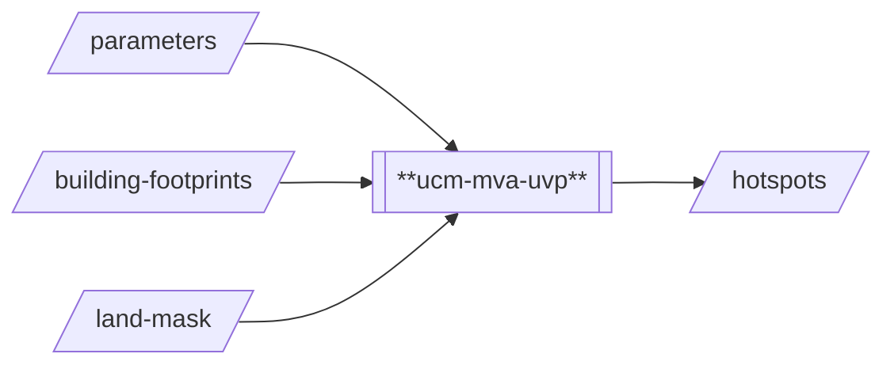
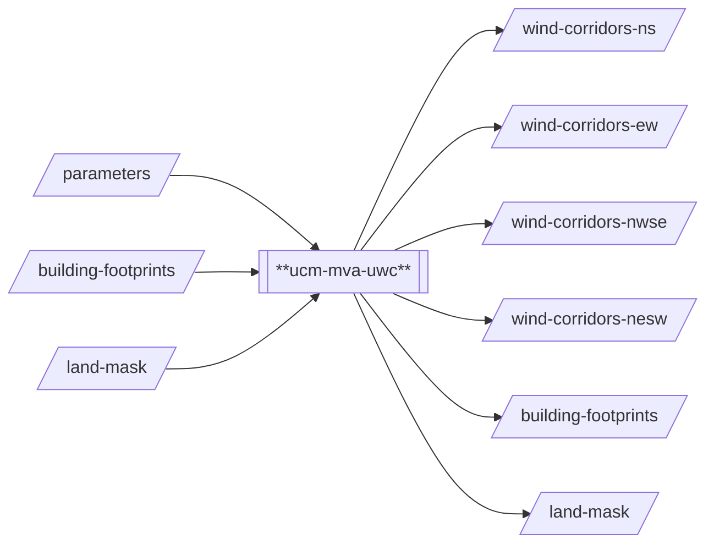

# Urban Climate Models / Multi-Variate Analysis 

## Introduction
MultiVariate Analysis (MVP) is used to analyse Urban Ventilation Potential (UVP) and Urban 
Wind Corridors (UWC). The underlying method and corresponding Python implementation (see
under `dependencies`) have been developed by Adelia Sukma and Ido Nevat and onboarded to the Cooling Singapore
Simulation-as-a-Service (Sim-aaS) platform by SEC Digital Twin Lab. For questions regarding 
the underlying model/method or the Sim-aaS adapters (`proc_uvp` and `proc_uwc`), please contact 
[cooling.singapore@sec.ethz.ch](cooling.singapore@sec.ethz.ch). 

## Prerequisites
Python 3.11

## Technical Documentation
### `ucm-mva-uvp`

This processor generates a hotspot map, i.e., a map that highlights the ventilation potential. This adapter
primarily prepares the input data into a format that the underlying model can work with. More specifically,
it converts geometric shapes (i.e., building footprints and land mask) into a raster with 1 meter resolution.
After rasterisation, the underlying model is executed. The output of the model (hotspots) is minimally 
post-processed by normalising the data before exporting it in GeoTIFF format.

### `ucm-mva-uwc`

This processor generates a wind corridor maps and forwards some inputs as outputs for convenience. The 
wind corridor maps show the likely path that wind is expected to take (based on urban permeability) 
given the principal wind direction. Wind corridor outputs are obtained by running the underlying model with 
four principal wind directions (north/south, east/west, north-west/south-est, north-east/south-west). This 
adapter primarily prepares the input data into a format that the underlying model can work with. More 
specifically, it converts geometric shapes (i.e., building footprints and land mask) into a raster with 1 
meter resolution. After rasterisation, the underlying model is executed four times (once for each principal
wind direction). The principal output of the model (wind corridors) is minimally post-processed by normalising 
the data before exporting it in GeoTIFF format.

## Important Notes 
None

## Known issues and Limitations 
- The underlying model is sensitive to the land mask. In case of Cooling Singapore, the city administrative zones 
  of Singapore have been used instead (basically assuming there is only the city and nothing else surrounding it).
  The actual land mask for the area of interest includes other land masses (e.g., Johor) which causes issues with 
  the generated results.
