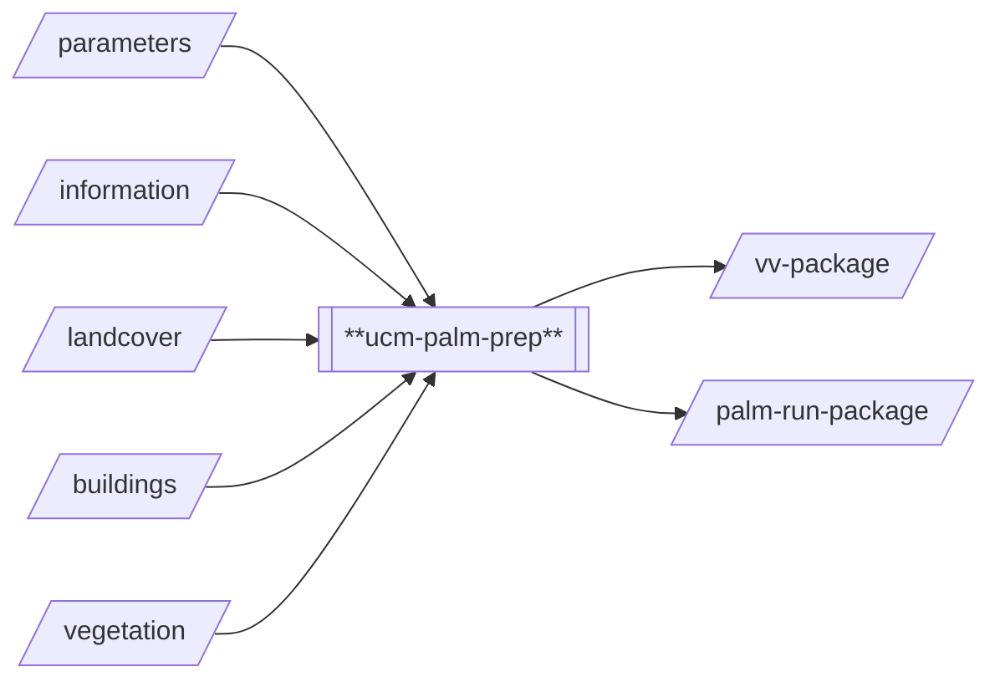
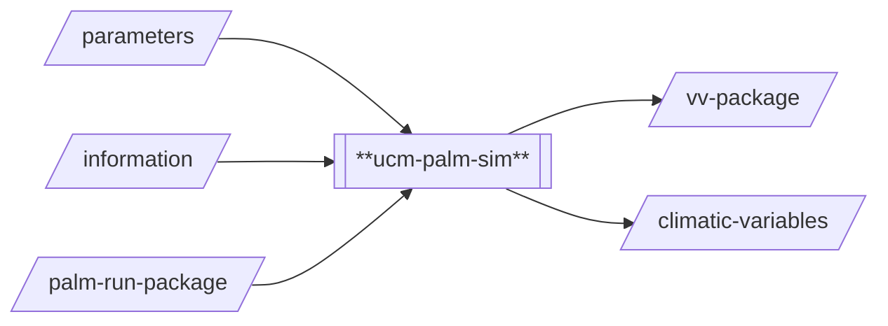

# Urban Climate Models / PALM 

## Introduction
PALM-4U (https://palm.muk.uni-hannover.de/trac/wiki/palm4u) is used to perform microscale urban
climate analysis. The underlying model for using PALM-4U in Cooling Singapore has been developed 
by Adelia Sukma and Mathias Niffeler and onboarded to the Cooling Singapore Simulation-as-a-Service
(Sim-aaS) platform by SEC Digital Twin Lab. For questions regarding the underlying model/method or 
the Sim-aaS adapters (`proc_prep` and `proc_sim`), please contact 
[cooling.singapore@sec.ethz.ch](cooling.singapore@sec.ethz.ch).

## Prerequisites
Python 3.10 (Conda Environment)

## Technical Documentation
### `palm_csd`
This folder contains scripts required to generate a static driver. It has been originally developed by
Leibniz Universitaet Hannover.

### `templates`
This folder contains custom code, templates and dynamic driver needed for simulating areas of interest
in Singapore. The contents have been created by the Cooling Singapore project. More specifically, this
includes:
- Custom `USER_CODE` required to handle AH data.
- A template for the `p3d` configuration file.
- Pre-computed contents needed for the run package (`package_contents.tar.gz`). In particular, this
  content includes a set of dynamic drivers that have been prepared specifically for use in Singapore.

### `ucm-palm-prep`

This processor prepare the necessary input files in order to execute a simulation using PALM-4U. More specifically,
it uses `landcover`, `building` and `vegetation` data to produce a static driver which can be used by PALM-4U. It
also generates AH data in a format that PALM-4U can understand based on AH information provided in thr `building` 
data. This processor produces two outputs: `vv-package` and `palm-run-package`. The `vv-package` output is an archive 
(tar.gz) that contains a number of "visual verification" GeoTIFF files that can be used to manually verify if the 
pre-processing has worked as intended and is primarily used for testing and debugging purposes. The `palm-run-package`
output contains all the files necessary for processor `ucm-palm-sim` to execute a simulation run. More specifically,
the run package contains the static driver, one of the template dynamic drivers as well as some parameters files
needed by PALM-4U.

### `ucm-palm-sim`

This processor uses a `palm-run-package` that has been generated by `palm-prep` and executes a simulation run using
PALM-4U. The implementation of this processor primarily handles the interaction with the NSCC ASPIRE2 job scheduler
to submit a PALM-4U job, monitor its progress, and trigger post-processing of the results once the simulation job
is done. This processor produces two outputs: `vv-package` and `climatic-variables`. The `vv-package` output is an 
archive (tar.gz) that contains a number of "visual verification" GeoTIFF files that can be used to manually verify if 
the `proc_sim` processor is working as intended and is primarily used for testing and debugging purposes. The 
`climatic-variables` output contains the post-processed simulation results. Post-processing essentially processes the
PALM-4U output NetCDF files `_av_xy.000.nc` and `_av_3d.000.nc` and extracts the variables of interest, including
wind speed, wind direction, relative humidity, air temperature, surface temperature and PET. The extracted variables
are then stored in `climatic-variables` in HDF5 format.

## Important Notes 
- The simulation process `proc_sim` is tailored to the use on the NSCC ASPIRE2 cluster. PALM-4U can also run in 
  other environments. Using this processor in another environment would require major modifications and/or 
  reimplementation.

## Known issues and Limitations 
None