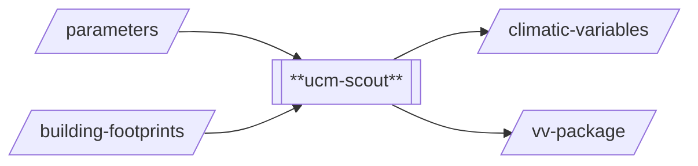

# Urban Climate Model / Scout 

## Introduction
Scout is a OpenFOAM-based model developed by A*STAR. It can be used to perform microscale 
urban climate analysis. Onboarding to the Cooling Singapore Simulation-as-a-Service 
(Sim-aaS) platform was done by SEC Digital Twin Lab. For questions regarding the 
underlying model/method or the Sim-aaS adapter (`ucm-scout`), 
please contact [cooling.singapore@sec.ethz.ch](cooling.singapore@sec.ethz.ch).

## Prerequisites
Python 3.10

## Technical Documentation
### `case_template`
The model is OpenFOAM based and requires a number of input files organised in a 
particular way. In order to avoid having to generate all files from scratch, a 
model template folder is provided that contains all the necessary files. Some
files may contain placeholders that need to be replaced with appropriate values for
the scenario that is being simulated. Placeholders can be identified by three leading
and trailing hash characters: e.g., `###WEST###`. The `ucm-scout` processor will make 
a copy of this folder, add the STL file representing the buildings and update the
various input files by replacing the placeholders with actual values. In addition
to model input and configuration files, the template folder also includes a template
for the PBS job file (`pbs.sh.template`), showing how exactly how the model is 
executed.

*Important:* In order for the `ucm-scout` adapter to work, the `CASE_TEMPLATE_PATH`
environment variable needs to be set to point at the `case_template` location. For
this purpose, please see `execute.sh` and update accordingly. 

### `ucm-scout`

This processor is primarily a Proof-of-Concept (PoC) adapter that demonstrates how A*STAR's
Scout model can be integrated into the DUCT environment. The processor implementation
covers the full workflow, including pre-processing input data, submitting and monitoring
a simulation run on NSCC's ASPIRE2 cluster, and post-processing the simulation results.
This is different from other urban climate model adapters used in the DUCT (i.e., 
`ucm-wrf` and `ucm-palm`) that split the pre-processing and the simulation+post-processing
steps into different processors. Due to the relatively simple pre-processing routine,
this separation was not necessary for `ucm-scout`.

The `ucm-scout` processor uses `building-footprint` data to produce a 3D geometric
model in STL format, as required by the Scout model. The current PoC implementation
of the adapter, does not consider any other inputs, such as vegetation or weather
types to drive the simulation. Similar to other DUCT urban climate models, the 
`ucm-scout` processor produces two outputs: `vv-package` and `climatic-variables`.
The `vv-package` output is an archive (tar.gz) that contains a number of "visual 
verification" GeoTIFF files that can be used to manually verify if the processor is 
working as intended and is primarily used for testing and debugging purposes. The 
`climatic-variables` output contains the post-processed simulation results in HDF5
format so it can be consumed by the DUCT Explorer. The PoC implementation of the 
Scout adapter is limited to extracting air temperature data only.

## Important Notes 
- The processor `ucm-scout` is tailored to the use on the NSCC ASPIRE2 cluster. 
More specifically, this refers to the code responsible for submitting and monitoring
the simulation job which is ASPIRE2-specific. 

## Known issues and Limitations 
- The processor is a PoC implementation that demonstrates how A*STAR's OpenFOAM-based
Scout model can be integrated into the DUCT. It's currently limited to a single 
climatic variable (air temperature) and only considers building footprints as input.
- The model seems to be sensitive to geometry complexity and may crash if building
footprints are too complex. For this purpose, the processor currently uses a basic
geometry simplification routine. Future work should systematically investigate the 
required degree of simplification and update the underlying model parameterisation
to make the model more robust.
