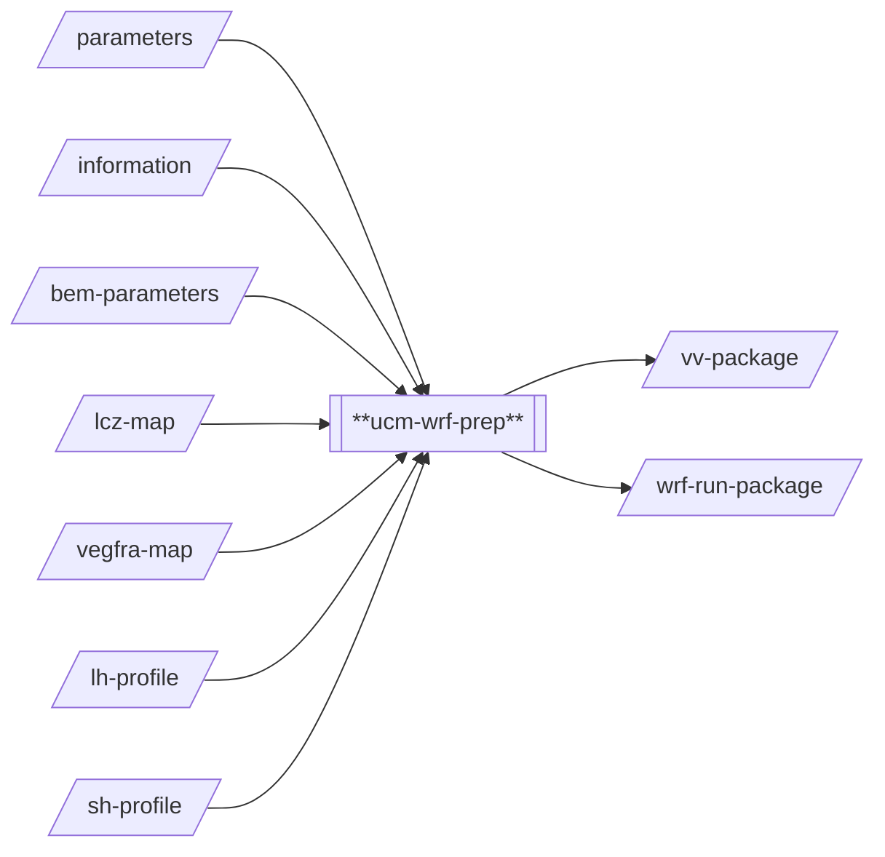
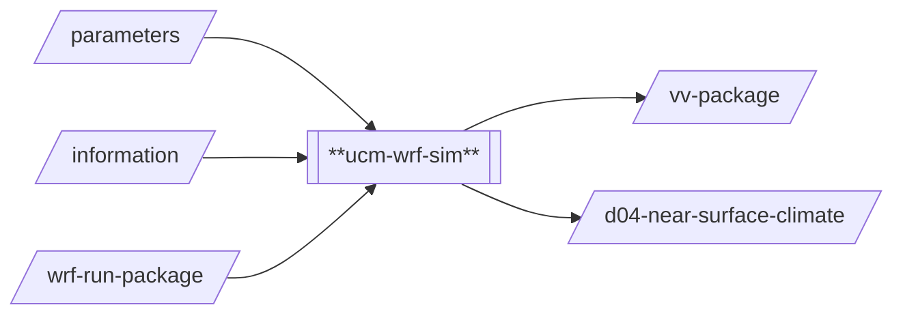

# Urban Climate Models / WRF 

## Introduction
mWRF-SG (https://github.com/cooling-singapore/mwrf_sg) is used to perform mesoscale urban
climate analysis. This model is a modified version of the Weather Research and Forecasting 
(WRF) model v4.3 (https://github.com/wrf-model/WRF) and has been developed by Muhammad 
Omer Mughal and Jerin Chalakkaal. Onboarding to the Cooling Singapore Simulation-as-a-Service 
(Sim-aaS) platform was done by SEC Digital Twin Lab. For questions regarding the underlying 
model/method or the Sim-aaS adapters (`ucm-wrf-prep` and `ucm-wrf-sim`), please contact 
[cooling.singapore@sec.ethz.ch](cooling.singapore@sec.ethz.ch).

## Prerequisites
Python 3.10 (Conda Environment)

## Technical Documentation
### `model`
The model adapters are tailored to the needs for being used as part of Cooling Singapore's
Digital Urban Climate Twin. Input used by `ucm-wrf-prep` is limited to the factors that are 
most relevant in the context of urban climate, i.e., the land-use as well as anthropogenic 
heat (AH) input. Meteorological data provided by NCEP
([ds083.3](https://rda.ucar.edu/datasets/ds083.3/)) is used to drive the simulation.

The model folder contains various templates and model input files that are used to tailor 
WRF for Cooling Singapore's requirements. The model adapters have been further tailored to
the use on NSCC's ASPIRE2 computing cluster. The model folder also contains corresponding
job templates.

### `ucm-wrf-prep`

This processor prepare the necessary input files in order to execute a simulation using WRF (`wrf.exe`). More 
specifically, it uses the following inputs: `lcz-map` (LCZ map as GeoTIFF), `vegfra-map` (vegetation fraction 
map indicating the fraction of vegetation at a particular location), `lh-profile` and `sh-profile` 
(anthropogenic heat profiles for sensible and latent heat respectively). This input data is primarily
used to generate static datasets used to initialise a WRF simulation. The model can be further parameterised
by settings in the `parameters` and `bem-parameters` files. Vegetation fractions for individual LCZ
categories can be set in `paramters` while building energy model parameters can set in `bem-parameters`. 
In addition to generating static data, dynamic data is also prepared based on the time period of interest 
specified in the `parameters`.

This processor produces two outputs: `vv-package` and `wrf-run-package`. The `vv-package` output is an archive 
(tar.gz) that contains a number of "visual verification" GeoTIFF files that can be used to manually verify if the 
pre-processing has worked as intended and is primarily used for testing and debugging purposes. The `wrf-run-package`
output contains all the files necessary for processor `ucm-wrf-sim` to execute a simulation run. More specifically,
the run package contains all relevant files that are needed for `wrf.exe` to run.

### `ucm-wrf-sim`

This processor uses a `wrf-run-package` that has been generated by `wrf-prep` and executes a simulation run using
`wrf.exe`. The implementation of this processor primarily handles the interaction with the NSCC ASPIRE2 job scheduler
to submit a WRF job, monitor its progress, and trigger post-processing of the results once the simulation job
is done. This processor produces two outputs: `vv-package` and `d04-near-surface-climate`. The `vv-package` output is an 
archive (tar.gz) that contains a number of "visual verification" GeoTIFF files that can be used to manually verify if 
the `proc_sim` processor is working as intended and is primarily used for testing and debugging purposes. The 
`d04-near-surface-climate` output contains the post-processed simulation results. Post-processing essentially 
processes the WRF output NetCDF file `wrfout_d04` and extracts the variables of interest. This includes near-surface
variables for wind speed, wind direction, relative humidity, and air temperature. The extracted variables
are then stored in `d04-near-surface-climate` in HDF5 format.

## Important Notes 
- The simulation process `proc_sim` is tailored to the use on the NSCC ASPIRE2 cluster. WRF can also run in 
  other environments. Using this processor in another environment would require major modifications and/or 
  reimplementation.

## Known issues and Limitations 
None

# UCM-WRF SaaS Module
UCM-WRF (Urban Climate Model - WRF) is a module containing a set of SaaS adapters for 
(1) [mWRF_SG](https://github.com/cooling-singapore/mWRF_SG) (which is a fork of   
[Weather Research and Forecasting (WRF)](https://github.com/wrf-model/WRF)) and
(2) [WRF Pre-processing System (WPS)](https://github.com/wrf-model/WPS). The adapters are called `ucm-wrf-sim` and 
`ucm-wrf-prep` for `mWRF-SG` and `WPS`, respectively. In general, `ucm-wrf-prep` is used to process input data and
prepare the necessary input for `ucm-wrf-sim`, which is used to carry out the actual simulation.

The adapters are tailored to the needs for being used as part of a Digital Urban Climate Twin. In particular, this
means, the input used by `ucm-wrf-prep` is limited to the factors that are most relevant in the context of urban 
climate, i.e., the land-use as well as anthropogenic heat (AH) input. Meteorological data provided by NCEP 
([ds083.3](https://rda.ucar.edu/datasets/ds083.3/)) is used to drive the simulation.

## Contents
- [Runtime Environment](#runtime-environment)
- [Dependencies](#dependencies)
- [Interfaces](#interfaces)

## Runtime Environment
The two adapters (`ucm-wrf-prep` and `ucm-wrf-sim`) have different runtime requirements. Preparing the
actual simulation run requires a lot of input that needs to be processed. However, this input data processing is 
done in sequential manner and does not benefit from parallel computing. On the other hand, the simulation produces a 
lot of data and greatly benefits from parallel computing resources. For this purpose, `ucm-wrf-prep` and `ucm-wrf-sim` 
have been developed with different runtime environments in mind. In the context of the Cooling Singapore project, 
supercomputing resources provided by Singapore's National Supercomputing Centre (NSCC) are utilised. For this purpose, 
the `ucm-wrf-sim` adapter has been developed specifically for NSCC's ASPIRE-1 runtime environment. Deploying 
`ucm-wrf-sim` is not possible without first making modifications to the adapter implementation. While `ucm-wrf-sim` 
has been tailored to a specific runtime environment, `ucm-wrf-prep` has been developed for a generic Ubuntu 20.04 
runtime environment to allow for increased operational flexibility.

## Dependencies
Both, `ucm-wrf-prep` and `ucm-wrf-sim` have dependencies to third party libraries. These are installed automatically
during deployment. For an exact list of dependencies, please refer to the corresponding `install.sh` scripts of the
`ucm-wrf-prep` and `ucm-wrf-sim` adapters. 

## Interfaces
The I/O interface of the `ucm-wrf-prep` adapter is shown below.

The `ucm-wrf-prep` adapter consumes the following inputs:
- `parameters`: a JSON encoded data object that allows the user to specify the start and end date/time for the simulation.
It also allows the user to specify RDA credentials that may be needed by the adapter for downloading [`ds083.3`](https://rda.ucar.edu/datasets/ds083.3) data.
- `lcz-map`: a TIFF encoded data object that defines the land-use of the area of interest.
- `lh-profile`: an archive (`tar.gz`) data object that contains anthropogenic heat profiles encoded as GeoJSON files that are to be used as sources of Latent Heat (LH).
- `sh-profile`: an archive (`tar.gz`) data object that contains anthropogenic heat profiles encoded as GeoJSON files that are to be used as sources of Sensible Heat (SH).

The `ucm-wrf-prep` adapter produces the following outputs:
- `vv-package`: an archive (`tar.gz`) data object that contains a variety of TIFF files that can be used for visual verification. The TIFF files are geocoded and can be opened and displayed using GIS software (e.g., QGIS). This is useful for users to quickly verify the output produced by the adapter before processing further the actual output data.
- `wrf-run-package`: an archive (`tar.gz`) data object that contains a variety of files that are needed to perform a WRF simulation run. This data object can be passed to `ucm-wrf-sim` to perform a simulation job.

The I/O interface of the `ucm-wrf-sim` adapter is shown below.

The `ucm-wrf-sim` adapter consumes the following inputs:
- `parameters`: a JSON encoded data object that allows users to specify technical parameters needed by the adapter to submit PBS jobs on ASPIRE-1.
- `wrf-run-package`: see explanation of `wrf-run-package` output produced by `ucm-wrf-prep` described above.

The `ucm-wrf-prep` adapter produces the following outputs:
- `vv-package`: an archive (`tar.gz`) data object that contains a variety of videos showing the output data. This is useful for users to quickly verify the output produced by the adapter before further processing the actual output data.
- `d04-near-surface-climate`: a HDF5 encoded data object that contains selected output data produced by the WRF simulation for domain D04. More specifically, this includes climate variables (air temperature, relative humidity, wind speed and direction) at near-surface height levels.
- `d04-complete-climate`: a HDF5 encoded data object that contains selected output data produced by the WRF simulation for domain D04. More specifically, this includes climate variables (air temperature, relative humidity, wind speed and direction) at all height levels.

